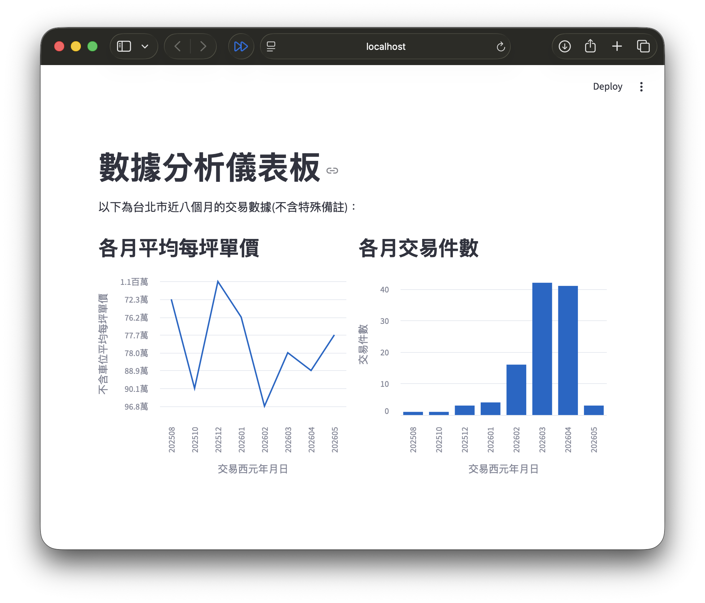

# 台灣房價dbt
用台灣房價做一點資料工程(用DBT)，順便用streamlit看一下視覺化長怎樣

## 資料來源
內政部實價登錄
網址：https://plvr.land.moi.gov.tw/DownloadOpenData \
下載「不動產買賣」跟「預售屋買賣」CSV

檢查一下csv\
f_lvr_land_a.csv是不動產交易資料，讓dbt自己幫我匯進postgres裡\
f_lvr_land_b.csv是預售屋交易資料，有的建案名稱有問號，算惹\
第二列是英文欄位，但我只想要中文欄位，第二列果斷刪掉\
可以寫個python取代這段手工刪掉的動作，但這次主要想練習dbt，就不寫惹

---
## 免載仔準備Progres資料庫
### 安裝
MAC安裝(開啟終端機)：\
更新一下brew `brew update`\
安裝prosgresql `brew install postgresql`\
裝好了。

### 建Database
一樣在終端機：\
進入postgres： `psql postgres`\
建立一個名叫raw的資料庫： `CREATE DATABASE raw`\
設定一個帳號名叫postgres的帳號跟密碼：`CREATE ROLE postgres WITH SUPERUSER LOGIN PASSWORD '你的密碼';`\
建好了，離開：`\q\`

## 安裝DBT
比較新版的dbt用的是dbt fusion，但不支援postgres\
還是得用較舊版的dbt core，dbt core是CLI指令，在vscode環境搭配DBT power user這個延伸模組就蠻好用的了\
根據資料庫選模組，我是用progres所以在終端機：`pip install dbt-core==1.8.0 dbt-postgres==1.8.0`\
安裝好了檢查一下：`dbt --version`\
建一個dbt專案：`dbt init`\
他會要你設定資料庫連線，然後跳出叫你輸入帳號密碼資料庫...輸入剛剛建的那些\
它會在.dbt裡自動產出一個profiles.yml\
範例是jaffle_shop\
架構跟範例一樣就好了，然後在profile.yml編輯新增自己的專案名字跟帳號密碼資料庫那類

---
### DBT架構
---
DBT的概念是用sql跟yaml設定格式，然後按照DBT的框架，就能生成所有資料\
專案文件夾裡面要包含這些資料夾跟文件，這就是他的框架
>taiwan-realestate-dbt \
├── dbt_project.yml &ensp; ←專案設定\
├── models &ensp;&ensp;&ensp;&ensp;&ensp;&ensp;&ensp;&ensp;&ensp; ←把轉換資料表的sql以及跟資料表有關的yaml放在這\
├── seeds &ensp;&ensp;&ensp;&ensp;&ensp;&ensp;&ensp;&ensp;&ensp;&ensp; ←把要匯進資料庫的csv放在這\
├── tests &ensp;&ensp;&ensp;&ensp;&ensp;&ensp;&ensp;&ensp;&ensp;&ensp;&ensp; ←單一測試的sql\
├── tests\
└── docs

### DBT步驟
---
step1:seeds準備好資料後，在終端機`dbt seed`然後DBT就自動把csv匯進資料庫。\
step2:models裡面分兩層，staging裡的sql寫完之後，就`dbt run --select 某一個model裡的sql名`，DBT就去執行這隻腳本並且在資料庫產生表或檢視，然後你就可以寫引用**這個sql腳本產生的結果**的sql。也可以`dbt run`就會一次跑完所有sql。\
eg.stg_a_lvr_land_a.sql把平方公尺換成坪數然後dbt run，dbt根據我在dbt_project.yml裡的設定，生成了一個view。
>models\
>├── staging &ensp;&ensp; ←原始資料表的簡單轉換(資料型態、重新命名欄位)，通常一張表一個sql，檔名通常前綴stg_\
>└── marts &ensp;&ensp;&ensp;&ensp;←有使用join或是匯總成一張欄位很多的表的sql，檔名通常前綴dim_

staging跟marts資料夾還會放入yaml檔，用來交代sql產生的表或檢視的欄位，以及step3的通用測試\
這裡有一個小訣竅，安裝一個名叫codegen的套件之後，在終端機輸入語法就可以幫你gen出source(step1的seeds裡的csv)的yaml☞
[傳送門](https://hub.getdbt.com/dbt-labs/codegen/latest/)，gen完source的yaml後，還可以點進yaml裡gen出model的sql\
step3:測試\
分成通用測試跟單一測試\
測試資料內容或邏輯的正確性測試， 通用測試寫在各自的yaml裡面；單一測試是針對特定邏輯的測試，寫在test資料夾裡面。\
`dbt test`執行所有測試\
`dbt source --select "source:*"`檢查資料源\
`dbt test --select test_type:generic`執行通用測試\
`dbt test --select test_type:singular`執行單一測試\
`dbt test --select 某一個model裡的sql名`只對那隻sql腳本的資料跟邏輯測試\
通用測試可以測試欄位是否為一(unique)、是否有空值(not null)、欄位值是否符合特定內容(accepted_values)、欄位值是否在其他表中的某欄(relationships)。\
到step3流程就大致完成了。\
(step4)最後可以使用`dbt build`，這個命令會一次執行`dbt seed`、`dbt run`、`dbt snapshot`、`dbt test`\
如果上游處理失敗，下游就會自動略過，當然也有選擇單一腳本的命令：`dbt build --select 某一個model裡的sql名`